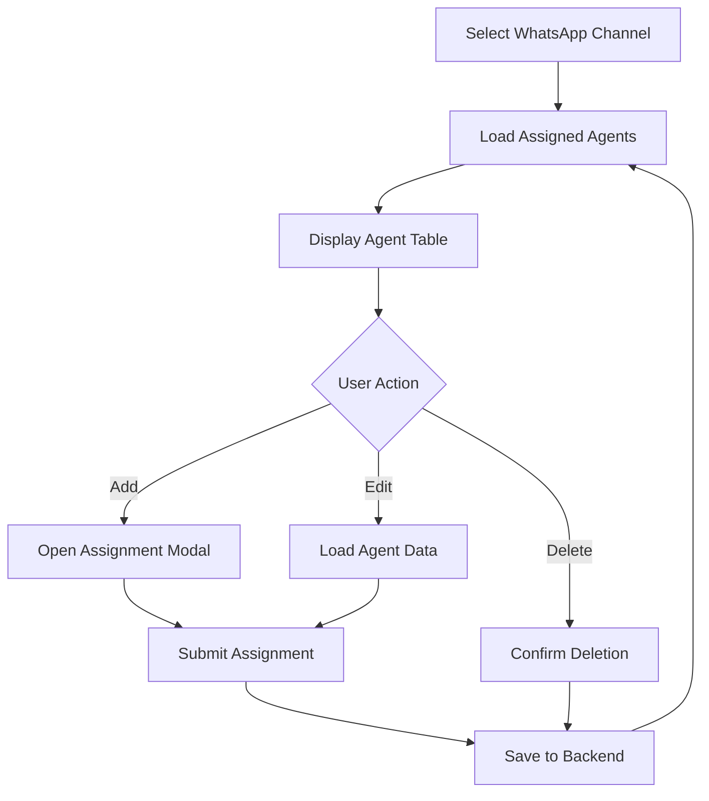

# Multi-Agent Support

The multi-agent support module enables you to assign multiple customer service agents to WhatsApp phone numbers, configure their priorities, and manage conversation workloads effectively.

## Business Value

<CardGroup cols={2}>
  <Card title="Workload Distribution" icon="scale-balanced">
    Balance conversation load across multiple agents
  </Card>
  <Card title="Priority Management" icon="arrow-up-1-9">
    Set agent priorities for intelligent routing
  </Card>
  <Card title="Capacity Control" icon="gauge-high">
    Limit maximum concurrent conversations per agent
  </Card>
  <Card title="Channel Assignment" icon="phone">
    Assign agents to specific WhatsApp Business phone numbers
  </Card>
</CardGroup>

## Key Features

### Agent Configuration

Each agent assignment includes:

```typescript
interface AgentAssignment {
  rowid: number;               // Unique assignment ID
  rowidUser: number;           // User/Agent ID
  rowidConfiguration: number;  // WhatsApp config ID
  priority: number;            // Agent priority (1 = highest)
  status: boolean;             // Active/inactive
  maxConversation: number;     // Max concurrent chats
}
```

## Implementation Guide

<Steps>
  <Step title="Component Setup">
    Import required modules and services:
    
    ```typescript
    import { Component, OnInit } from '@angular/core';
    import { MasterService } from '../../services/master.service';
    import { WhatsappService } from '../../services/whatsapp.service';
    import { AuthService } from '../core/guards/auth.service';
    import { LoginService } from '../../services/login.service';
    
    @Component({
      selector: 'app-agents',
      standalone: true,
      imports: [
        CommonModule,
        FormsModule,
        TableModule,
        ButtonModule,
        DialogModule,
        DropdownModule,
        TagModule,
        AvatarModule,
        BadgeModule,
        TooltipModule,
        InputNumberModule
      ],
      providers: [MessageService]
    })
    export class AgentsComponent implements OnInit {
      // Component implementation
    }
    ```
  </Step>

  <Step title="Load Initial Data">
    Fetch WhatsApp channels and system users:
    
    ```typescript
    private fetchInitialData(): void {
      // Load WhatsApp phone numbers/channels
      this.whatsappService.getByPhoneNumbers().subscribe({
        next: (res) => {
          if (res.code === 0) this.channels = res.data || [];
        }
      });
      
      // Load system users
      this.masterService.getUsers(this.companiaId).subscribe({
        next: (res) => {
          this.systemUsers = res.data || [];
        }
      });
    }
    ```
  </Step>

  <Step title="Select Channel">
    When a channel is selected, load assigned agents:
    
    ```typescript
    onSelectChannel(channel: PhoneNumbers): void {
      this.selectedConfigId = channel.rowId;
      this.fetchAssignedAgents();
    }
    
    fetchAssignedAgents(): void {
      if (!this.selectedConfigId) return;
      
      this.isLoading = true;
      this.whatsappService.getAgents(this.selectedConfigId).subscribe({
        next: (res: any) => {
          this.assignedAgents = res.data || [];
          this.isLoading = false;
        },
        error: () => {
          this.isLoading = false;
          this.showToast('error', 'Error', 'Could not load assigned agents');
        }
      });
    }
    ```
  </Step>

  <Step title="Assign Agent">
    Create a new agent assignment:
    
    ```typescript
    openAssignModal(): void {
      this.assignmentForm.agentId = null;
      this.isAssignModalVisible = true;
    }
    
    onAssignAgent(): void {
      if (!this.assignmentForm.agentId || !this.selectedConfigId) return;
      
      const payload = {
        rowid: this.assignmentForm.rowidAgent,
        rowidUser: this.assignmentForm.agentId,
        rowidConfiguration: this.selectedConfigId,
        priority: this.assignmentForm.priority,
        status: true,
        maxConversation: this.assignmentForm.maxConversations
      };
      
      this.whatsappService.assignAgent(payload).subscribe({
        next: () => {
          this.showToast('success', 'Success', 'Agente asignado correctamente.');
          this.isAssignModalVisible = false;
          this.fetchAssignedAgents();
        }
      });
    }
    ```
  </Step>
</Steps>

## Agent Assignment Form

### Form Structure

```typescript
assignmentForm = {
  rowidAgent: 0,              // 0 for new, ID for edit
  agentId: null as number | null,
  priority: 1,                // Default priority
  maxConversations: 10        // Default max concurrent chats
};
```

### Form Fields

<Tabs>
  <Tab title="Agent Selection">
    Dropdown to select user from system users:
    
    ```html
    <p-dropdown 
      [(ngModel)]="assignmentForm.agentId"
      [options]="systemUsers"
      optionLabel="name"
      optionValue="id"
      placeholder="Select Agent"
    >
    </p-dropdown>
    ```
  </Tab>
  
  <Tab title="Priority">
    Numeric input for priority (1 = highest):
    
    ```html
    <p-inputNumber 
      [(ngModel)]="assignmentForm.priority"
      [min]="1"
      [max]="100"
    >
    </p-inputNumber>
    ```
    
    <Note>
      Lower numbers indicate higher priority. Agent with priority 1 will receive conversations before priority 2.
    </Note>
  </Tab>
  
  <Tab title="Max Conversations">
    Set maximum concurrent conversations:
    
    ```html
    <p-inputNumber 
      [(ngModel)]="assignmentForm.maxConversations"
      [min]="1"
      [max]="50"
    >
    </p-inputNumber>
    ```
    
    This prevents agent overload by limiting active conversations.
  </Tab>
</Tabs>

## Channel Selection

Display available WhatsApp Business phone numbers:

```typescript
channels: PhoneNumbers[] = [];
selectedConfigId: number | null = null;

// Phone number interface
export interface PhoneNumbers {
  rowId: number;
  phoneNumberId: string;        // WhatsApp Business Phone ID
  displayPhoneNumber: string;   // Formatted number
  verifyToken: string;
  accessToken: string;
  name: string;                 // Business name
  state: boolean;               // Active/inactive
  isBot: boolean;               // AI bot enabled
}
```

### Channel Card Display

```html
<div class="grid">
  <div *ngFor="let channel of channels" class="col-12 md:col-6 lg:col-4">
    <p-card 
      [class.selected]="selectedConfigId === channel.rowId"
      (click)="onSelectChannel(channel)"
    >
      <div class="flex align-items-center gap-3">
        <p-avatar 
          icon="pi pi-whatsapp" 
          size="large" 
          styleClass="bg-green-500"
        >
        </p-avatar>
        <div>
          <div class="font-bold">{{ channel.name }}</div>
          <div class="text-sm text-gray-600">
            {{ channel.displayPhoneNumber }}
          </div>
        </div>
        <p-badge 
          [value]="channel.state ? 'Active' : 'Inactive'"
          [severity]="channel.state ? 'success' : 'secondary'"
        >
        </p-badge>
      </div>
    </p-card>
  </div>
</div>
```

## Agent Management

### View Assigned Agents

Display agents assigned to the selected channel:

```typescript
assignedAgents: any[] = [];
isLoading: boolean = false;
```

### Agent Table

```html
<p-table 
  [value]="assignedAgents" 
  [loading]="isLoading"
  styleClass="p-datatable-sm"
>
  <ng-template pTemplate="header">
    <tr>
      <th>Agent</th>
      <th>Priority</th>
      <th>Max Conversations</th>
      <th>Status</th>
      <th>Actions</th>
    </tr>
  </ng-template>
  
  <ng-template pTemplate="body" let-agent>
    <tr>
      <td>
        <div class="flex align-items-center gap-2">
          <p-avatar 
            [label]="agent.name.charAt(0)"
            size="normal"
            shape="circle"
          >
          </p-avatar>
          {{ agent.name }}
        </div>
      </td>
      <td>
        <p-badge 
          [value]="agent.priority"
          severity="info"
        >
        </p-badge>
      </td>
      <td>{{ agent.maxConversation }}</td>
      <td>
        <p-tag 
          [value]="agent.status ? 'Active' : 'Inactive'"
          [severity]="agent.status ? 'success' : 'secondary'"
        >
        </p-tag>
      </td>
      <td>
        <button 
          pButton 
          icon="pi pi-pencil" 
          class="p-button-text p-button-sm"
          (click)="editAgent(agent)"
          pTooltip="Edit"
        >
        </button>
        <button 
          pButton 
          icon="pi pi-trash" 
          class="p-button-text p-button-danger p-button-sm"
          (click)="onRemoveAgent(agent)"
          pTooltip="Remove"
        >
        </button>
      </td>
    </tr>
  </ng-template>
</p-table>
```

## Edit Agent Assignment

Modify existing agent configuration:

```typescript
editAgent(agent: any): void {
  this.assignmentForm.rowidAgent = agent.rowid;
  this.assignmentForm.agentId = agent.rowidUser;
  this.assignmentForm.priority = agent.priority;
  this.assignmentForm.maxConversations = agent.maxConversation;
  
  this.isAssignModalVisible = true;
}
```

## Remove Agent Assignment

Delete an agent assignment:

```typescript
onRemoveAgent(agent: any): void {
  this.whatsappService.deleteAgent(agent.id).subscribe({
    next: () => {
      this.showToast('info', 'Removed', 'Assignment deleted');
      this.fetchAssignedAgents();
    }
  });
}
```

## Permission System

The module uses permission-based access control:

```typescript
permissions: Permission[] = [];

canView = false;
canCreate = false;
canEdit = false;
canDelete = false;
canExport = false;

ngOnInit(): void {
  const session = this.authService.getSession();
  
  if (!session) {
    this.resetPermissions();
    return;
  }
  
  const { userId, companiaId } = session;
  
  this.loginService.getPermissions(userId, companiaId).subscribe({
    next: (permissions) => {
      this.permissions = permissions.data ?? [];
      this.applyPermissions();
    },
    error: () => this.resetPermissions()
  });
  
  this.fetchInitialData();
}

private applyPermissions(): void {
  const moduleName = 'Agentes';
  const permission = this.permissions.find(p => p.module === moduleName);
  
  if (!permission) {
    this.resetPermissions();
    return;
  }
  
  this.canView = permission.canView;
  this.canCreate = permission.canCreate;
  this.canEdit = permission.canEdit;
  this.canDelete = permission.canDelete;
  this.canExport = permission.canExport;
}

private resetPermissions(): void {
  this.canView = false;
  this.canCreate = false;
  this.canEdit = false;
  this.canDelete = false;
  this.canExport = false;
}
```

## WhatsApp Service Integration

The component uses the WhatsApp service for agent management:

```typescript
@Injectable({ providedIn: 'root' })
export class WhatsappService {
  private apiUrl = 'https://localhost:7197/api/';

  getAgents(configId: number) {
    return this.http.get<any[]>(
      `${this.apiUrl}WhatsApp/GetAgents/${configId}`
    );
  }

  getAgentsByPhoneNumberId(phoneNumberId: string) {
    return this.http.get<any[]>(
      `${this.apiUrl}WhatsApp/GetAgentsByPhoneNumberId/${phoneNumberId}`
    );
  }

  assignAgent(payload: any) {
    return this.http.post(
      `${this.apiUrl}WhatsApp/AssignAgent`, 
      payload
    );
  }

  deleteAgent(id: number) {
    return this.http.delete(
      `${this.apiUrl}WhatsApp/DeleteAgent/${id}`
    );
  }
}
```

## UI Components

### Required PrimeNG Modules

```typescript
imports: [
  CommonModule,
  FormsModule,
  TableModule,        // Agent table
  ButtonModule,       // Action buttons
  DialogModule,       // Assignment modal
  DropdownModule,     // Agent/channel selection
  TagModule,          // Status tags
  AvatarModule,       // User avatars
  BadgeModule,        // Priority badges
  TooltipModule,      // Tooltips
  InputNumberModule   // Numeric inputs
]
```

## Toast Notifications

Show user feedback for actions:

```typescript
private showToast(severity: string, summary: string, detail: string): void {
  this.messageService.add({ severity, summary, detail });
}

// Examples
this.showToast('success', 'Success', 'Agente asignado correctamente.');
this.showToast('error', 'Error', 'Could not load assigned agents');
this.showToast('info', 'Removed', 'Assignment deleted');
```

## Agent Routing Logic

While not in the UI component, the backend uses agent configuration for routing:

<Steps>
  <Step title="Priority-based Selection">
    When a new conversation arrives, the system selects agents with the lowest priority number first.
  </Step>
  
  <Step title="Capacity Check">
    Only assign to agents who haven't reached their `maxConversation` limit.
  </Step>
  
  <Step title="Round-robin within Priority">
    Among agents with the same priority, distribute conversations evenly.
  </Step>
  
  <Step title="Active Status">
    Only route to agents with `status: true`.
  </Step>
</Steps>

## Best Practices

<AccordionGroup>
  <Accordion title="Priority Configuration">
    - Use priority 1-5 for primary agents
    - Priority 6-10 for backup agents
    - Reserve priority 99+ for overflow/emergency
    
    Example:
    ```typescript
    const priorities = {
      senior: 1,
      regular: 5,
      trainee: 10,
      overflow: 99
    };
    ```
  </Accordion>
  
  <Accordion title="Capacity Management">
    Set `maxConversations` based on agent experience:
    - New agents: 3-5 conversations
    - Experienced agents: 10-15 conversations
    - Senior agents: 15-20 conversations
  </Accordion>
  
  <Accordion title="Channel Organization">
    - Assign specialized agents to specific channels
    - Use different teams for different business lines
    - Separate support and sales channels
  </Accordion>
  
  <Accordion title="Performance Monitoring">
    Track agent metrics:
    - Response time
    - Conversations handled
    - Customer satisfaction
    - Resolution rate
  </Accordion>
</AccordionGroup>

## Data Flow



## Troubleshooting

<AccordionGroup>
  <Accordion title="Agents Not Receiving Conversations">
    Check:
    1. Agent status is `true` (active)
    2. Priority is set correctly
    3. `maxConversation` limit not reached
    4. Phone number configuration is active
  </Accordion>
  
  <Accordion title="Assignment Not Saving">
    Verify:
    - Valid user ID selected
    - Valid configuration ID
    - Priority and max conversations are positive numbers
    - User has permission to create assignments
  </Accordion>
  
  <Accordion title="Duplicate Assignments">
    The system should prevent assigning the same agent to the same channel twice. Check backend validation.
  </Accordion>
</AccordionGroup>

## Future Enhancements

Potential improvements:

1. **Agent Availability Schedule**: Configure working hours
2. **Automatic Reassignment**: Redistribute conversations when agents go offline
3. **Skill-based Routing**: Route by agent expertise
4. **Load Balancing Metrics**: Real-time conversation distribution graphs
5. **Agent Performance Dashboard**: Track KPIs per agent
6. **Bulk Assignment**: Assign multiple agents at once

## Reference

- Component: `~/workspace/source/src/app/components/pages/agents/agents.component.ts`
- Lines: 1-202
- Service: `~/workspace/source/src/app/components/services/whatsapp.service.ts`
- Dependencies: WhatsApp Service, Master Service, Auth Service